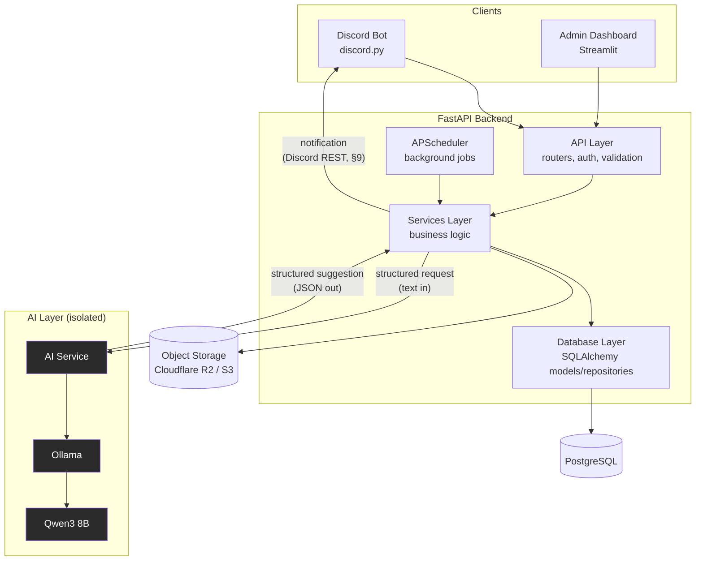
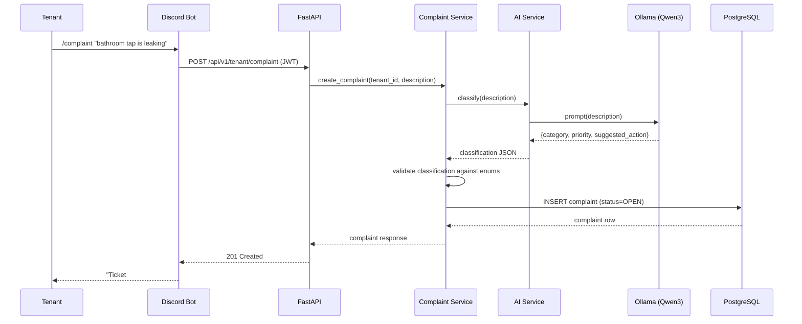
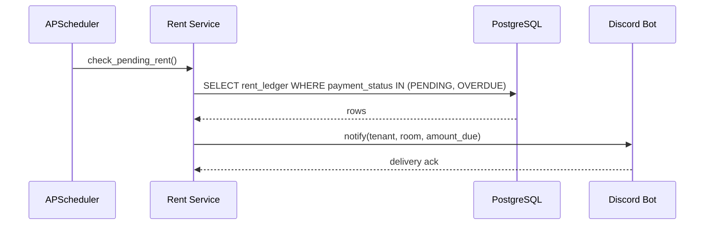

# PG OS — System Architecture

Status: Phase 2 (Database) and all of Phase 3 (Backend — 3a, 3b, and 3c) implemented under `backend/`. This was originally a Phase 1 (Architecture-only) document; §4.6, §7, §12, and §13 below now also record where implementation confirmed or corrected the original design — see [DATABASE.md](DATABASE.md) and [API.md](API.md) for the fuller implementation notes.

## 1. Overview

PG OS is a backend-first operating system for running a Paying Guest (PG) accommodation business. A single FastAPI backend is the source of truth for all data and business rules. Three surfaces sit on top of it — a Discord bot, an admin dashboard, and a local AI service — and none of them are permitted to bypass it.

Initial scale: 1 building, 30 rooms, 70 beds, multiple tenants. The design must not block the stated future goal of becoming a multi-PG SaaS platform, but it should not be over-built for that goal today (see [§10](#10-multi-tenancy--future-saas-path)).

## 2. Architectural Style

Layered / clean architecture, single writer of record:

- **One backend, one database.** The Discord bot, the dashboard, and the AI service are all clients of the FastAPI backend. None of them holds a database connection.
- **Unidirectional dependency flow.** API → Services → Database. A layer may only call the layer directly below it.
- **AI is advisory, not authoritative.** The AI service can read text and return structured suggestions. It cannot write to PostgreSQL and has no database credentials. The backend service layer decides what, if anything, gets persisted.

## 3. System Diagram

The AI box has no arrow into PostgreSQL. That is intentional and non-negotiable (see [§5](#5-layering--dependency-rules)).

## 4. Components

### 4.1 Discord Bot (`discord_bot/`)

- Library: `discord.py`, slash commands (`app_commands`) only — no legacy text-prefix commands, no privileged gateway intents (message content / members / presences) requested, since interaction payloads deliver `interaction.user` directly without needing them.
- Commands: `/link`, `/rent`, `/complaint`, `/rules`, `/status` — the four from CLAUDE.md's Discord Bot Requirements, plus the account-linking command that makes the other four usable. All five are thin wrappers (`discord_bot/cogs/tenant_commands.py`): resolve the caller's Discord id, call the backend, format the response. No business logic in the bot process — every command call is a call to a FastAPI endpoint, never a direct decision made in `discord_bot/` itself.
- **Account linking**: `/link` opens a `discord.ui.Modal` (email/phone + password) rather than inline slash-command options, so the password never appears in a message or a command-invocation log. Discord has no native masked/password field for modals — a real platform limitation, not something worked around in code — but this is still meaningfully more private than a plain-text slash command argument: ephemeral, never posted to a channel, never in message history. On submit, the bot logs in via `POST /api/v1/auth/login` (the same endpoint the dashboard uses) and calls `POST /api/v1/auth/link-discord` ([API.md](API.md) §4.1) to set `users.discord_id` to the caller's own Discord snowflake.
- **Session storage**: once linked, the bot holds that user's access/refresh token pair **in memory only**, keyed by Discord user id (`discord_bot/api_client.py`) — not the dashboard's single-browser-session model, since one bot process serves many Discord users concurrently. Access tokens refresh automatically on a `401`, mirroring `dashboard/api_client.py`'s pattern. A restart drops every session; the affected user just runs `/link` again. See §12 item 20.
- **Async HTTP**: `discord_bot/api_client.py` uses `httpx.AsyncClient`, not the dashboard's sync `requests` — this process runs inside discord.py's asyncio event loop, where a blocking call would stall every other command the bot is handling concurrently.
- All command responses are **ephemeral** (visible only to the invoking user) — rent balances and complaint details are personal, not public-channel content.
- Every command requires a linked session, `/rules` included — consistent with [API.md](API.md) §1's "every endpoint requires Bearer auth" rule rather than carving out an unauthenticated exception for one command.
- Holds no direct database access. Maps Discord users to PG OS accounts via `discord_id` on the `users` table (see [DATABASE.md](DATABASE.md) §4.1).
- The reverse direction — backend-initiated notifications *to* Discord — is a separate mechanism, not this process; see §9.

### 4.2 Admin Dashboard (`dashboard/`)

- Streamlit initially; React is the documented future replacement.
- Renders occupancy, rent, complaint, and expense views by calling the same FastAPI APIs the bot and any future clients use — no separate read path, no direct SQL, and no PostgreSQL driver in this project's dependencies at all, so that constraint is structural rather than just a convention someone could accidentally violate.
- **Role-based navigation** (`dashboard/app.py`): the page list passed to `st.navigation()` is built per-request from the logged-in user's role — Occupancy/Rent/Complaints are registered for OWNER, MANAGER, and STAFF; Expenses only for OWNER/MANAGER (see [API.md](API.md) §3). This is a genuine access boundary, not just a hidden link: `st.navigation` will not execute a page outside the current rerun's registered list even when asked to directly (`switch_page`), confirmed in `tests/dashboard/test_navigation.py`. The backend's own per-endpoint RBAC is still the authoritative check — the dashboard-side boundary is defense-in-depth, not a replacement for it.
- **Per-view role narrowing**: several views additionally show a smaller subset of their own content by role — e.g. Occupancy's per-room breakdown, Rent's income trend and payment-recording action, and Complaints' category-breakdown report are all OWNER/MANAGER-only within a page all three staff roles can otherwise open — mirroring [API.md](API.md) §3's per-endpoint RBAC one level down, since a page being reachable and a specific report/action within it being callable are governed by different backend roles.
- **Client-side enrichment, not backend joins**: list endpoints (rent ledger, complaints) return bare foreign keys (`tenant_id`, `room_id`), not denormalized names — the dashboard fetches `/tenants` and `/rooms` once per page render and joins by ID in-memory for display. Acceptable at current scale (single building, page sizes capped at 100); revisit if the backend should embed names directly once list volume grows. See §12 item 18.
- Session/auth state (`access_token`, `refresh_token`, `role`) lives in `st.session_state`, scoped to one browser session; `api_client.py` retries once on a `401` using the refresh token before forcing a re-login.

### 4.3 FastAPI Backend (`backend/app/`)

The backend is internally layered:

| Layer | Directory | Responsibility |
|---|---|---|
| API | `api/` | HTTP routing, request/response schemas (Pydantic), auth dependency injection. No business logic. |
| Services | `services/` | Business rules, orchestration, transactions. Only layer allowed to call the AI service. |
| Database | `database/`, `models/` | SQLAlchemy models, session management, repository-style queries. |
| Security | `security/` | JWT issuing/verification, password hashing, RBAC checks. |
| Schemas | `schemas/` | Pydantic request/response contracts, shared across API and services. |
| Utils | `utils/` | Cross-cutting helpers with no business meaning of their own. |

Background jobs (APScheduler) live in the backend process and call the services layer exactly like an API request would — they do not touch the database layer directly, so a scheduled job and an HTTP request that trigger the same action run the same code path.

### 4.4 PostgreSQL

Single relational store for all operational data. See [DATABASE.md](DATABASE.md) for schema. Reachable only from the Database layer inside the backend.

### 4.5 AI Service (`ai_engine/`)

- Its own `uv` project (like `dashboard/` and `discord_bot/`), calling a local Ollama server — `qwen3:8b` for chat/generation, `nomic-embed-text` for embeddings (a separate, smaller model chosen specifically for RAG; see [AI_DESIGN.md](AI_DESIGN.md) §3 and §12 item 28).
- **No database credentials in its runtime config, verifiably** — `ai_engine/config.py`'s `Settings` class has no `database_url` field at all (docs/ROADMAP.md Phase 6's definition of done). Stateless with respect to PG OS data: every call receives exactly the text/context it needs and returns a structured JSON suggestion; it never queries the database, including for RAG (see below).
- Endpoints: `POST /classify` (complaint category/priority/suggested_action), `POST /summarize` (stats JSON → narrative text), `POST /answer` (question + retrieved context chunks → answer), `POST /embed` (text → vector). One module (`ollama_client.py`) is the only thing that knows Ollama's actual REST API shape.
- **RAG's retrieval step lives in the backend, not here.** pgvector similarity search needs database access, which this service deliberately never has — the backend's `app/services/rag_service.py` does the vector query itself (it already holds DB credentials, that's its job) and sends `ai_engine/` only the already-retrieved text chunks as part of the `/answer` request. Retrieval and generation are different steps; only generation is delegated. See [AI_DESIGN.md](AI_DESIGN.md) §1, §3.
- **Every output is a suggestion, validated by the caller, not by this service.** `ai_engine/` doesn't know PG OS's `ComplaintCategory`/`Priority` enums and doesn't try to enforce them — `app/services/complaint_service.py` is what actually checks a classification response against [DATABASE.md](DATABASE.md) §5 before persisting anything, falling back to a safe default on anything invalid (§5 item 5 below).
- Capabilities: complaint classification, tenant FAQ (RAG over PG rules / rent policy / maintenance instructions), management summary generation. Full design in [AI_DESIGN.md](AI_DESIGN.md).
- Not verified against a live Ollama server in this environment — see §12 item 27.

### 4.6 Object Storage (Cloudflare R2 / S3-compatible)

- Holds tenant documents (ID proofs, agreements, photos).
- Backend issues short-lived pre-signed upload/download URLs; clients (dashboard, bot-driven flows) upload directly to storage, then confirm completion to the backend, which records `storage_url` and `verification_status`. The backend never proxies file bytes through itself.
- **Implemented (Phase 3c) behind a `StorageBackend` protocol** (`backend/app/storage/base.py`) so `document_service.py` never knows which concrete backend is active:
  - **Local filesystem** (`app/storage/local.py`) — the default, for dev/test. Not a fake stand-in: "presigned URLs" are real, working signed-token-scoped links back to this same app's own `/internal/storage/*` routes, so upload/download genuinely round-trips real bytes through real HTTP, verified end-to-end in tests and by hand against a live server.
  - **S3-compatible** (`app/storage/s3.py`) — real Cloudflare R2 or AWS S3 via boto3's standard `generate_presigned_url`. Selected via `STORAGE_BACKEND=s3`; `STORAGE_S3_ENDPOINT_URL` + `STORAGE_S3_REGION=auto` is what targets R2 instead of AWS (Cloudflare's own documented approach). Not verified against a live bucket — see §12 item 15.
- `STORAGE_LOCAL_BASE_URL` must match wherever the server is actually reachable from the client's perspective (default `http://localhost:8000` assumes the conventional dev port) — found by smoke-testing on a non-default port and getting a silent connection failure until it was corrected.

## 5. Layering & Dependency Rules

1. API routers depend only on services. They never import SQLAlchemy models or open a DB session directly.
2. Services own transactions. A service method either fully succeeds or rolls back — no partial writes leaked to callers.
3. The database layer has no awareness of HTTP, Discord, or AI concepts — it only knows about persistence.
4. The AI service is called only from the services layer, never from an API router and never from the Discord bot or dashboard directly. This keeps the "AI never touches the database" rule enforceable in one place instead of scattered across every client.
5. The AI service's output is a suggestion. The service layer validates it against real constraints (e.g., an AI-suggested `priority` must be one of the enum values in [DATABASE.md](DATABASE.md); if not, the service falls back to a default) before persisting anything.

## 6. Request Flow Examples

### 6.1 Tenant files a complaint (Discord → AI classification → DB)

### 6.2 Scheduled job: daily pending-rent check

## 7. Authentication & Authorization

- **AuthN:** JWT access tokens (15 min, `app/security/jwt.py`) + refresh tokens (30 days), issued by `security/`. Passwords hashed with Argon2id (`argon2-cffi`) — decided in Phase 3a as OWASP's current recommended default, over bcrypt/passlib (passlib has known version-detection issues with modern bcrypt releases).
- **AuthZ:** Role-based access control with four roles: `OWNER`, `MANAGER`, `STAFF`, `TENANT`. Every API router declares the minimum role required per endpoint via the `require_roles(...)` dependency factory (`app/api/deps.py`); the security layer enforces it as a FastAPI dependency, not as ad-hoc checks inside handlers. Full permission matrix in [API.md](API.md).
- A `TENANT`-role token is additionally scoped to that tenant's own `tenant_id` via the `get_current_tenant` dependency — tenant self-service endpoints filter by the authenticated tenant, never by a client-supplied ID. A `TENANT`-role user with no linked `tenants` row (`tenants.user_id`) gets `403`, not a crash.
- **Logout / revocation:** JWTs are stateless by design, so "logging out" can't just mean "the client forgets the token" if a leaked refresh token should also stop working. `POST /api/v1/auth/logout` bumps `users.token_version` (Phase 3a addition, see [DATABASE.md](DATABASE.md) §4.1); every refresh token embeds the version it was issued under, and `POST /api/v1/auth/refresh` rejects a mismatch. Access tokens are not similarly checked — their 15-minute lifetime is the accepted exposure window, checking token_version on every request would mean a DB lookup per request for no real benefit.

## 8. Configuration & Secrets

- All configuration (database URL, JWT secret, Ollama host, storage credentials, Discord bot token) is read from environment variables via `.env` in development, real environment variables in production.
- No secret is ever committed. `.env.example` documents required keys with placeholder values.
- Config is loaded once at startup through a typed settings object (Pydantic `BaseSettings`), not read ad hoc via `os.environ` scattered through the codebase.

## 9. Background Jobs (APScheduler)

| Job | Schedule | Action |
|---|---|---|
| Pending rent check | Daily, 08:00 | Query `rent_ledger` for `PENDING`/`OVERDUE` entries; notify affected tenants and management via the Discord bot. |
| Management report | Daily, 21:00 | Summarize the day's occupancy, rent, complaints, expenses; post to a management Discord channel. |
| Income report | Monthly (1st, 09:00) | Aggregate the prior month's rent and expenses into an income report. |

Jobs call the services layer only — see [§4.3](#43-fastapi-backend-backendapp).

**Implemented in full as of Phase 6.** `app/services/scheduled_jobs.py` holds the three job bodies above; `app/main.py`'s `lifespan` registers them on a `BackgroundScheduler` with `CronTrigger`s matching the table exactly. Each job opens and closes its own `SessionLocal()` (jobs run outside any request, so there's no request-scoped `get_db` to depend on — same reasoning as `app/database/seed.py`) and catches its own exceptions, logging rather than propagating, so one bad run (Discord down, AI down, whatever) never crashes the scheduler or blocks the next job.

- **Pending rent check** needs no AI — a plain query plus a notification fan-out. Tenants with no linked `discord_id` (haven't run `/link`) are silently skipped, not treated as an error.
- **Management report** calls `app/services/scheduled_jobs.build_management_summary()`, which reuses `dashboard_service.get_dashboard_summary()`'s stats and asks `ai_engine/` to narrate them — the exact same function backs the on-demand `GET /api/v1/reports/summary` ([API.md](API.md) §5.12), so the job and the endpoint can never drift apart. Falls back to a plain-text stats readout (not a failure) if the AI service is unavailable.
- **Income report** aggregates the prior month via `dashboard_service.get_income_report(months=1)` — no AI narration, just the numbers.

The delivery mechanism itself (`app/services/notification_service.py`, Phase 5) sends outbound Discord messages — `send_discord_dm(discord_id, message)` for per-tenant notifications, `send_channel_message(channel_id, message)` for the two report jobs — via Discord's plain REST API, using the same bot token as `discord_bot/`. It does **not** go through the interactive bot process: sending a message never needs a gateway connection, only *receiving* interactions does, and the bot is a separate long-lived process anyway.

The scheduler is disabled in the test suite (`tests/backend/conftest.py` sets `SCHEDULER_ENABLED=false` before `Settings` is ever instantiated) — a real background thread has no business starting and stopping on every one of ~200 per-test `TestClient` instances. Job *logic* is still fully tested (`tests/backend/test_scheduled_jobs.py`) by calling the functions directly with an injected session, same pattern as `seed()`'s optional `db` parameter.

Unverified against a live Discord account or Ollama server — see §12 items 25, 27.

## 10. Multi-Tenancy / Future SaaS Path

The schema already models `Building` as a first-class entity, and `Room` (and optionally `Expense`) scope to `building_id`, even though v1 operates a single building. This is deliberate: it means the step from "one PG" to "multiple PGs under one owner" is a data change (add another `building` row), not a schema change.

Becoming a true multi-tenant SaaS (multiple unrelated PG *businesses* on shared infrastructure) is explicitly a **future goal**, not a v1 requirement, and is **not** implemented now: there is no `organization`/`account` boundary above `Building`, and rows are not partitioned by tenant-of-the-SaaS. When that becomes a real requirement, the natural extension is an `organization_id` above `Building`, propagated through row-level security or query scoping — but building that now would be speculative for a 30-room, single-owner deployment.

## 11. Non-Functional Requirements

- **Security:** JWT auth, RBAC on every endpoint, hashed passwords, no direct AI-to-DB path, secrets only via environment variables, pre-signed URLs for document storage instead of proxying files.
- **Reliability:** Service-layer transactions (no partial writes); Alembic migrations are the only way schema changes reach the database (no manual `ALTER TABLE`).
- **Observability:** Structured logging from the API and services layers (request id, user id, action) at minimum; deferred to Phase 3/7 for concrete tooling choice.
- **Performance:** At 30 rooms / 70 beds and a handful of admin users, there is no scale problem to solve. Indexing (see [DATABASE.md](DATABASE.md) §7) is chosen for query correctness and common access patterns, not premature optimization.
- **Portability:** Everything runs via Docker Compose in development; production targets a VPS/Railway (backend), Supabase (Postgres), Cloudflare R2 (storage), and a self-hosted Ollama instance — no component requires a proprietary managed service it can't be swapped out of.

## 12. Open Questions / Assumptions Made in This Phase

These are architectural decisions made to keep the spec complete and buildable. Flagging them here so they can be corrected before Phase 2 turns them into schema/code:

1. **Rent collection is tracked, not processed.** CLAUDE.md's stack has no payment gateway. This design assumes rent is collected offline (cash/UPI/bank transfer) and recorded into `rent_ledger` by staff or the tenant reporting it — PG OS does not move money. If online payment collection is actually required, that's a new component (payment gateway integration) not currently in scope. *(Still open — unaffected by Phase 2.)*
2. **A `User`/auth entity is added.** CLAUDE.md's Database Design section doesn't list a users table, but JWT auth + RBAC requires one. `users` is added with a nullable link from `tenants.user_id` (a tenant may or may not have portal/bot login access) — see [DATABASE.md](DATABASE.md). *(Implemented in Phase 2 as designed.)*
3. **Primary keys are UUIDs, not auto-increment integers** — chosen for non-enumerable tenant-facing IDs and to avoid ID collisions if multiple PGs' data is ever merged under the future SaaS model. See [DATABASE.md](DATABASE.md) §2 for the full rationale. *(Implemented in Phase 2 as designed.)*
4. **API paths are pluralized and versioned** (`/api/v1/tenants`, not `/tenant`) to follow REST convention, formalizing the illustrative endpoints listed in CLAUDE.md. See [API.md](API.md) for the mapping. *(Implemented in Phase 3a as designed, for every resource group built so far.)*
5. **Document uploads use pre-signed URLs** rather than the backend proxying file bytes. *(Still open — Documents endpoints are Phase 3b.)*
6. **No `pgcrypto` extension needed, contrary to what Phase 1 assumed.** [DATABASE.md](DATABASE.md) §1 originally said UUID generation required the `pgcrypto` extension. Verified empirically against Postgres 16: `gen_random_uuid()` is a core built-in function since PostgreSQL 13, present with zero extensions installed. Corrected in [DATABASE.md](DATABASE.md) §1 — the initial migration does not create any extension.
7. **The seed script lives at `backend/app/database/seed.py`, not top-level `database/seed.py`.** The original Phase 1 mapping (§13 below) put it outside the `backend` package, which would have required cross-package `PYTHONPATH` tricks for no real benefit. Corrected in [DATABASE.md](DATABASE.md) §9.
8. **`Room.status = FULL` and `Bed.status = OCCUPIED` are treated as derived, not staff-editable.** Neither CLAUDE.md nor the Phase 1 docs said so explicitly, but once the allocation service (Phase 3a) is the thing that's supposed to keep these in sync with actual occupancy, letting `PATCH /rooms/{id}` or `PATCH /beds/{id}` also set them directly would let staff put a room/bed into a state that lies about occupancy. Both PATCH endpoints reject those two specific values with `400`; every other status value on both resources (`MAINTENANCE`, `INACTIVE`, `VACANT`) is still a normal manual edit. See [API.md](API.md) §5.5.
9. **Deleting a Building/Room/Tenant is blocked (`409`) while it still has active children** (rooms/beds, or an active allocation, respectively) — soft delete alone doesn't enforce this at the database level the way the documented `ON DELETE RESTRICT` semantics do for hard deletes ([DATABASE.md](DATABASE.md) §6), so the service layer enforces the equivalent by hand. Not explicitly requested by CLAUDE.md; added so "removed from active use" can't silently orphan still-active data.
10. **`DELETE /api/v1/expenses/{id}` was removed from the spec in Phase 3b.** An earlier draft of [API.md](API.md) §5.9 had it, contradicting [DATABASE.md](DATABASE.md) §2's own rule that `expenses` (like `rent_ledger`, `security_deposits`, `complaints`, `allocations`) is append-only and never deleted. Caught before implementation, not after — no migration or code ever had a delete path for this table.
11. **Complaint classification defaults to a placeholder, not real AI, until Phase 6.** [ARCHITECTURE.md](ARCHITECTURE.md) §6.1 describes the AI classifier assigning `category`/`priority` when a tenant files a complaint, but the AI service doesn't exist yet — Phase 6 is unbuilt. Phase 3b's interim: `category` defaults to `OTHER` (the tenant may optionally suggest one instead), `priority` always starts at `MEDIUM`. This is a single, clearly-marked call site in `app/services/complaint_service.py` — Phase 6 replaces the placeholder assignment with a real classifier call (validated against the same enums) without changing the API contract at all.
12. **Documents endpoints are deferred to a new Phase 3c, not built in Phase 3b.** [ARCHITECTURE.md](ARCHITECTURE.md) §4.6 calls for pre-signed R2/S3 upload URLs, which needs real object-storage credentials to build and verify honestly — this environment has none. Building it against a fake/local stand-in would produce code that's never actually been proven to work against real storage, which is worse than not building it yet. See [ROADMAP.md](ROADMAP.md).
13. **The system can never end up with zero active `OWNER` accounts via the API.** Not requested by CLAUDE.md, but a natural consequence of Users being `OWNER`-only (§5.10): if the last owner could demote or deactivate themselves (or another owner) with no owner left, nobody could use the Users API to fix it again — an unrecoverable lockout short of direct database access. `PATCH /api/v1/users/{id}` rejects (`409`) any role-change-away-from-`OWNER` or `is_active=false` that would leave zero other active owners. See `app/services/user_service.py`.
14. **Dashboard/report response shapes were designed during Phase 3b, not specified beforehand.** [API.md](API.md) §5.12 originally gave the dashboard's shape but only named the three report endpoints' paths and roles. Designed and documented in [API.md](API.md) §5.12 alongside implementation.
15. **The S3/R2 backend's presigned URLs are not verified against a live bucket or through an external HTTP client.** No real Cloudflare/AWS credentials exist in this environment (§12 item 12 explains why Documents was split into its own phase over this). What *was* verified, using `moto` (an in-process AWS mock) with real `boto3` calls: bucket-config validation raises a clear error when misconfigured; `object_exists()` correctly reflects real (mocked) bucket state after a direct `put_object`/delete; `generate_upload_target()`/`generate_download_url()` produce well-formed URLs referencing the correct bucket and key. What wasn't verified: actually consuming a generated presigned URL via a plain HTTP client (`httpx`) — tried directly, and this sandbox's own outbound `HTTPS_PROXY` intercepts the request to `*.amazonaws.com` before moto's interception applies, producing an unrelated 403. This is specific to this sandboxed environment, not a defect in the presigned-URL code, which follows boto3's standard, well-documented pattern.
16. **The local storage backend's "presigned URLs" are a genuine, working mechanism, not a stub** — signed, time-limited, single-key-scoped tokens (reusing the JWT infrastructure from Phase 3a, `StorageTokenAction` in `app/security/jwt.py`) consumed by this same app's own `/internal/storage/{key}` routes (mounted only when `STORAGE_BACKEND=local`). Verified with real HTTP PUT/GET through them, including rejecting a token used for the wrong action, the wrong key, or after expiry.
17. **A document's `storage_key` is validated to actually belong to the confirming tenant** (`app/services/document_service.py`) before a `POST /api/v1/tenant/documents` is accepted — not just that *something* was uploaded to it. Since keys are server-generated as `tenants/{tenant_id}/{uuid4()}`, a 128-bit-random key isn't practically guessable, but checking the prefix costs nothing and closes the gap outright rather than relying on that being merely impractical.
18. **Dashboard list views enrich by ID client-side rather than the backend embedding denormalized names.** `GET /api/v1/rent` and `GET /api/v1/complaints` return bare `tenant_id`/`room_id`; `dashboard/views/rent.py` and `complaints.py` fetch `/tenants`/`/rooms` once per render and join in Python. Not requested by CLAUDE.md or [API.md](API.md); chosen over widening the API response shape for what's a display-only concern, tenable at current scale (page sizes capped at 100 — see `app/api/deps.py`). Revisit if a future phase needs the backend to embed names directly (e.g. a higher-traffic multi-PG SaaS view).
19. **`st.navigation`'s page list is a real access boundary, not just a UI convenience.** Verified empirically (`tests/dashboard/test_navigation.py`): a STAFF session calling `switch_page("views/expenses.py")` — bypassing the sidebar entirely — still lands back on the default page instead of executing `expenses.py`, because that page was never added to `st.navigation()`'s list for that role. The dashboard still treats this as defense-in-depth, not the authoritative check: every write path is independently enforced by the backend's own per-endpoint RBAC (`app/api/routers/*.py`), which is what actually stops a crafted request.
20. **The bot's per-user session store is in-memory only, not persisted.** `discord_bot/api_client.py` keeps each linked user's token pair in a plain `dict` keyed by Discord id. Not requested by CLAUDE.md or [ROADMAP.md](ROADMAP.md); chosen over adding a bot-local database/cache (SQLite, Redis) for the sole purpose of surviving a restart, which would be new persistence infrastructure for a problem whose cost is "run `/link` again" — cheap and non-destructive. Revisit if the bot ever needs to run across multiple processes/replicas, where in-memory state stops being viable regardless of restart frequency.
21. **`/link`'s modal cannot mask the password field — a Discord platform limitation, not a gap in this implementation.** `discord.ui.Modal` text inputs have no password/masked style as of the discord.py version used here. Using a modal instead of inline slash-command options was still the deliberate choice: the value is never posted to a channel or left in message history, unlike a plain-text `/link email password` command would be. Documented here so it isn't mistaken for an oversight.
22. **`POST /api/v1/auth/link-discord` was added — a self-service endpoint CLAUDE.md/the original [API.md](API.md) didn't specify.** The `discord_id` column existed since Phase 2 ([DATABASE.md](DATABASE.md) §4.1), but the only way to set it was the OWNER-only Users API (`PATCH /api/v1/users/{id}`) — unusable for a tenant linking their own account. Same shape as every other "added to make a listed feature actually work" endpoint in this document's deviations note. Relies on `users.discord_id`'s existing `UNIQUE` constraint + the global `IntegrityError` → `409` handler for the conflict case, no manual pre-check — same pattern as `create_user`/`update_user` in `app/services/user_service.py`.
23. **PG rules content is a static file (`backend/app/content/pg_rules.md`), not a database table.** CLAUDE.md's Database Design section has no rules entity, and adding one for a single static document the owner edits rarely would be schema weight with no query benefit over a file. `GET /api/v1/rules` ([API.md](API.md) §4.1) reads and caches it; editing the file needs a process restart to take effect, not a migration. Phase 6 replaces the *source* of this content with `pgvector`-backed RAG over the same file — the endpoint's contract doesn't need to change when that happens.
24. **The example PG rules content is a placeholder, not real policy.** `backend/app/content/pg_rules.md` says so at the top of the file itself. Same category of decision as the seed data's example tenants — plausible, clearly-labeled placeholder content instead of leaving the feature unbuilt for lack of the real thing.
25. **`discord_bot/` and `app/services/notification_service.py` are correct but unverified against a live Discord account** — no bot token exists in this environment, the same gap [§12 item 15](#12-open-questions--assumptions-made-in-this-phase) documents for the S3/R2 storage backend. What *is* verified for real: every backend endpoint the bot depends on (`tests/backend/`), the bot's entire HTTP-calling layer — login, linking, session refresh-on-401, all 5 tenant self-service/rules calls — against the live backend with zero mocks (`tests/discord_bot/test_api_client.py`), and that the command tree registers all 5 commands with correct names/descriptions/parameters (`tests/discord_bot/test_cog_registration.py`). What remains unverified: the actual Discord gateway connection, `tree.sync()` registering commands with Discord's servers, and a real modal-submit interaction round-trip. All three need nothing but a real `DISCORD_BOT_TOKEN` in `discord_bot/.env` to exercise — no code changes.
26. **A Discord server's own roles (Owner/Manager/Maintenance/Tenant, per CLAUDE.md's Discord Bot Requirements) are organizational, not a security boundary this bot enforces.** They're Discord's own channel/permission concept, set up by whoever administers the actual server (this environment can't create one — no Discord credentials, see item 25) and are informational at best from the bot's point of view. Every command re-derives authorization from the caller's *linked PG OS account* (its JWT role, checked by the backend), never from whatever role Discord says that member has — a Discord "Tenant" role with no linked account still gets "run `/link` first," and a linked TENANT account works identically regardless of Discord-side role. Recommended real-server setup (for whoever stands one up): four roles matching CLAUDE.md's names for channel organization, a private management channel for `DISCORD_MANAGEMENT_CHANNEL_ID` (§9), and the bot invited with the `applications.commands` + `bot` scopes and no privileged intents (§4.1).
27. **`ai_engine/` and everything that calls it are correct but unverified against a live Ollama server** — this sandbox's outbound network policy blocks both `ollama.com` and `huggingface.co` (confirmed via the proxy's own connection log, not assumed), so Ollama can't be installed and no model weights can be fetched here, a harder gap than the missing *credentials* in items 15/25 (there's no way to self-host the runtime at all in this environment). Asked how to proceed; chose "build now, verify later" — the same choice made for the S3 backend and the Discord bot. What **is** verified for real: every line of `ai_engine/` against a hand-rolled Ollama-API-shaped test server (`tests/ai_engine/fake_ollama.py`, the same role `moto` plays for AWS — see item 15) via genuine HTTP, `backend/app/services/ai_client.py`'s contract with a *real* `ai_engine/` subprocess pointed at that fake server (`tests/backend/test_ai_client.py`), and every bit of validation/fallback/orchestration logic in `complaint_service.py`, `rag_service.py`, and `scheduled_jobs.py` against real Postgres. What isn't and can't be verified here: that Qwen3 8B or `nomic-embed-text`, actually running, produce good classifications, embeddings, or answers. See [AI_DESIGN.md](AI_DESIGN.md) §6-7.
28. **RAG embeddings use `nomic-embed-text`, not Qwen3 8B** — CLAUDE.md names Qwen3 8B generically without distinguishing chat vs. embedding use, but a dedicated embedding model is standard RAG practice (smaller, faster, trained specifically to produce embeddings that cluster well for similarity search) and Ollama supports running multiple models side by side. `ai_engine/config.py` exposes `OLLAMA_CHAT_MODEL`/`OLLAMA_EMBED_MODEL` as separate settings. The embedding dimension (768, `nomic-embed-text`'s documented output size) is hardcoded into the `rag_document_chunks.embedding` column ([DATABASE.md](DATABASE.md) §4.12) since pgvector needs a fixed dimension at table-creation time — unverified against a live model, so a different real-world embedding model choice needs a new migration to change it before ingesting. See [AI_DESIGN.md](AI_DESIGN.md) §3.
29. **`complaints.suggested_action` was added** — a nullable text column holding the AI classifier's advisory next-step suggestion, shown to staff as context. Not in CLAUDE.md's original Database Design (predates the AI phase) or the classifier's documented output shape's persistence — CLAUDE.md's classification example returns `suggested_action` but never says where it's stored; discarding it after generating it would waste the one part of the classification a human actually acts on. Nothing automated reads it — "the backend decides actions" (this file's own AI rule) still holds; a human staff member reads the suggestion and decides.
30. **`GET /api/v1/reports/summary` was added** — CLAUDE.md's Management Summary description (stats in, human-readable report out) doesn't specify an API surface, only that scheduled jobs post it to Discord. Added so the same summary is available on-demand (OWNER/MANAGER, e.g. from the dashboard) without waiting for the 21:00 job, sharing one function (`scheduled_jobs.build_management_summary()`) with the job so the two can't drift apart. See [API.md](API.md) §5.12.
31. **`CREATE EXTENSION vector` needs a one-time privileged setup step, confirmed by actually running the migration as the app's normal (non-superuser) role** — not assumed. Full detail in [DATABASE.md](DATABASE.md) §8's Phase 6 note; the short version is that a fresh database needs a superuser (or managed-provider equivalent, e.g. Supabase's own Extensions UI) to enable `vector` once, exactly like creating the `pgos` role/database itself is already a manual provisioning step — `alembic upgrade head` works for everyone afterward since the extension already exists by then.

## 13. Repository-to-Architecture Mapping

| Folder | Architectural layer |
|---|---|
| `backend/app/api/` | API layer |
| `backend/app/services/` | Services layer |
| `backend/app/models/`, `backend/app/database/` | Database layer |
| `backend/app/security/` | AuthN/AuthZ |
| `backend/app/schemas/` | Request/response contracts |
| `backend/app/storage/` | Object storage abstraction (§4.6) — not in the original Phase 1 mapping, added in Phase 3c |
| `backend/app/content/` | Static, owner-editable knowledge base source (PG rules, rent policy, maintenance instructions) — not in the original Phase 1 mapping, added in Phase 5/6. `rag_service.py` ingests it into `rag_document_chunks` (§4.12). |
| `discord_bot/` | Client — Discord surface |
| `dashboard/` | Client — admin surface |
| `ai_engine/` | AI layer (isolated, no DB access) |
| `database/` | Reserved for raw SQL / reference artifacts (e.g. a schema dump) if a future phase needs one — not used by Phase 2. The seed script lives at `backend/app/database/seed.py` instead (see [DATABASE.md](DATABASE.md) §9); this folder does not exist yet. |
| `docs/` | This documentation set |
| `tests/` | Unit, API, and database tests |
| `docker/` | Container definitions |

## See Also

- [DATABASE.md](DATABASE.md) — schema, relationships, indexing, enums
- [API.md](API.md) — endpoint specification, permission matrix
- [ROADMAP.md](ROADMAP.md) — phased delivery plan
