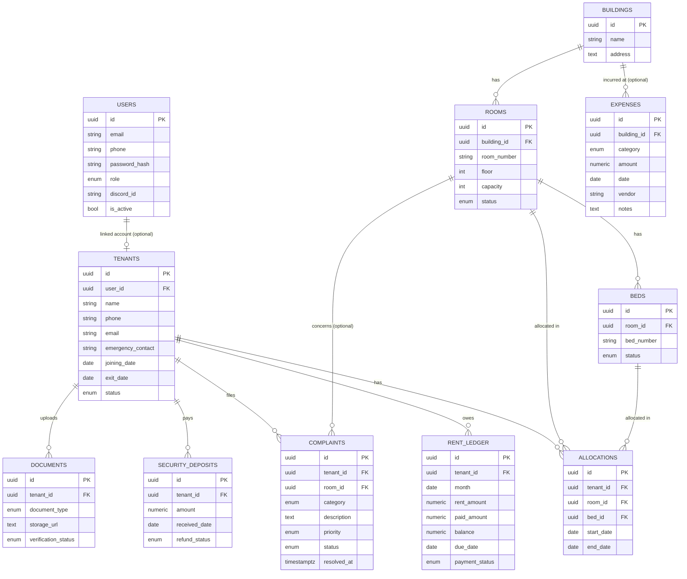

# PG OS — Database Design

Status: Phase 2 (Database) implemented — SQLAlchemy models, initial Alembic migration, connection module, and seed script all exist under `backend/`. This document has been updated to match; see the "Phase 2 implementation notes" callouts below for anything that changed from the original Phase 1 design.

## 1. Overview

- Engine: PostgreSQL (developed/tested against 16)
- ORM: SQLAlchemy 2.0 (`backend/app/models/`)
- Migrations: Alembic (`backend/alembic/`) — schema changes only ever happen through a migration, never a manual `ALTER TABLE` against a live database
- Extensions: none required for the schema itself — `gen_random_uuid()` has been a core PostgreSQL 13+ function since PG13, not a `pgcrypto`-only function as originally assumed in Phase 1 (verified directly: it works on a fresh database with zero extensions installed). `pgvector` remains a real, separate future requirement for Phase 6 (AI/RAG).

## 2. Conventions

| Convention | Decision | Rationale |
|---|---|---|
| Primary keys | `UUID` (v4), default `gen_random_uuid()` | Non-enumerable in tenant-facing APIs (no IDOR-by-guessing); avoids ID collisions if multiple PG properties' data is ever merged under the future SaaS model. At this scale (~100 rows/table) the minor index-size cost vs. `BIGSERIAL` is irrelevant. |
| Table names | Plural, `snake_case` (`tenants`, `rent_ledger`) | Standard SQLAlchemy/Postgres convention; a table is a collection of rows. |
| Column names | `snake_case` | Postgres convention; avoids quoting. |
| Money | `NUMERIC(10,2)` | Exact decimal arithmetic — never `FLOAT`/`DOUBLE` for currency. |
| Timestamps | `TIMESTAMPTZ` | Always store in UTC; convert at the presentation layer. |
| Audit fields | `created_at TIMESTAMPTZ NOT NULL DEFAULT now()`, `updated_at TIMESTAMPTZ`, `created_by UUID NULL REFERENCES users(id)`, `updated_by UUID NULL REFERENCES users(id)` | Applied to every table. `created_by`/`updated_by` are nullable to allow system/scheduler-originated rows. |
| Soft delete | `is_deleted BOOLEAN NOT NULL DEFAULT false`, `deleted_at TIMESTAMPTZ NULL` | Applied to **master/reference data** the business can "remove" from active use: `buildings`, `rooms`, `beds`, `tenants`, `documents`, `users`. **Not** applied to append-only financial/audit records — `rent_ledger`, `security_deposits`, `complaints`, `expenses`, `allocations` are never deleted, only status-transitioned, so history is always reconstructable. |
| Enums | Native Postgres `ENUM` types via SQLAlchemy `Enum` | Enforced at the database level, not just application level. |

## 3. Entity-Relationship Diagram

## 4. Entities

Audit columns (`created_at`, `updated_at`, `created_by`, `updated_by`) and, where applicable, soft-delete columns (`is_deleted`, `deleted_at`) are omitted from the tables below to avoid repetition — assume every entity has the audit columns, and every entity marked **soft-delete: yes** in its heading also has `is_deleted`/`deleted_at`.

### 4.1 `users` (soft-delete: yes)

Added beyond CLAUDE.md's explicit entity list — required to back JWT auth + RBAC (see [ARCHITECTURE.md](ARCHITECTURE.md) §12).

| Column | Type | Constraints | Notes |
|---|---|---|---|
| id | UUID | PK | |
| email | VARCHAR(255) | UNIQUE, NOT NULL | Login identifier for staff/owner. |
| phone | VARCHAR(20) | UNIQUE, NULL | |
| password_hash | VARCHAR(255) | NOT NULL | bcrypt/argon2 — finalized in Phase 3. |
| role | ENUM `user_role` | NOT NULL | `OWNER`, `MANAGER`, `STAFF`, `TENANT`. |
| discord_id | VARCHAR(32) | UNIQUE, NULL | Links a Discord account to a PG OS user for bot commands. |
| is_active | BOOLEAN | NOT NULL DEFAULT true | Deactivate without deleting. |

### 4.2 `buildings` (soft-delete: yes)

| Column | Type | Constraints | Notes |
|---|---|---|---|
| id | UUID | PK | |
| name | VARCHAR(255) | NOT NULL | |
| address | TEXT | NULL | |

### 4.3 `rooms` (soft-delete: yes)

| Column | Type | Constraints | Notes |
|---|---|---|---|
| id | UUID | PK | |
| building_id | UUID | FK → `buildings.id`, NOT NULL | |
| room_number | VARCHAR(20) | NOT NULL | |
| floor | INTEGER | NULL | |
| capacity | INTEGER | NOT NULL, CHECK (capacity > 0) | Max beds in the room. |
| status | ENUM `room_status` | NOT NULL DEFAULT `AVAILABLE` | `AVAILABLE`, `FULL`, `MAINTENANCE`, `INACTIVE`. |

Constraint: `UNIQUE (building_id, room_number)`.

### 4.4 `beds` (soft-delete: yes)

| Column | Type | Constraints | Notes |
|---|---|---|---|
| id | UUID | PK | |
| room_id | UUID | FK → `rooms.id`, NOT NULL | |
| bed_number | VARCHAR(10) | NOT NULL | |
| status | ENUM `bed_status` | NOT NULL DEFAULT `VACANT` | `VACANT`, `OCCUPIED`, `MAINTENANCE`. |

Constraint: `UNIQUE (room_id, bed_number)`.

### 4.5 `tenants` (soft-delete: yes)

| Column | Type | Constraints | Notes |
|---|---|---|---|
| id | UUID | PK | |
| user_id | UUID | FK → `users.id`, UNIQUE, NULL | Set only if the tenant has portal/bot login access. |
| name | VARCHAR(255) | NOT NULL | |
| phone | VARCHAR(20) | NOT NULL, UNIQUE | |
| email | VARCHAR(255) | UNIQUE, NULL | |
| emergency_contact | VARCHAR(20) | NULL | |
| joining_date | DATE | NOT NULL | |
| exit_date | DATE | NULL | |
| status | ENUM `tenant_status` | NOT NULL DEFAULT `ACTIVE` | `ACTIVE`, `NOTICE_PERIOD`, `EXITED`, `BLACKLISTED`. |

### 4.6 `allocations` (soft-delete: no — append-only)

| Column | Type | Constraints | Notes |
|---|---|---|---|
| id | UUID | PK | |
| tenant_id | UUID | FK → `tenants.id`, NOT NULL | |
| room_id | UUID | FK → `rooms.id`, NOT NULL | Denormalized alongside `bed_id` for query convenience (a bed's room shouldn't change, but this avoids a join for room-level occupancy checks). |
| bed_id | UUID | FK → `beds.id`, NOT NULL | |
| start_date | DATE | NOT NULL | |
| end_date | DATE | NULL | `NULL` = currently active allocation. |

Constraint: partial unique index ensuring a bed has at most one active allocation at a time: `UNIQUE (bed_id) WHERE end_date IS NULL`.

### 4.7 `rent_ledger` (soft-delete: no — append-only)

| Column | Type | Constraints | Notes |
|---|---|---|---|
| id | UUID | PK | |
| tenant_id | UUID | FK → `tenants.id`, NOT NULL | |
| month | DATE | NOT NULL | First-of-month convention, e.g. `2026-08-01`, for one row per tenant per month. |
| rent_amount | NUMERIC(10,2) | NOT NULL, CHECK (rent_amount >= 0) | |
| paid_amount | NUMERIC(10,2) | NOT NULL DEFAULT 0, CHECK (paid_amount >= 0) | |
| balance | NUMERIC(10,2) | NOT NULL | Maintained as `rent_amount - paid_amount` by the service layer (application-computed, not a generated column, so partial payments can be recorded with an audit trail). |
| due_date | DATE | NOT NULL | |
| payment_status | ENUM `payment_status` | NOT NULL DEFAULT `PENDING` | `PENDING`, `PARTIAL`, `PAID`, `OVERDUE`. |

Constraint: `UNIQUE (tenant_id, month)`.

### 4.8 `security_deposits` (soft-delete: no — append-only)

| Column | Type | Constraints | Notes |
|---|---|---|---|
| id | UUID | PK | |
| tenant_id | UUID | FK → `tenants.id`, NOT NULL | |
| amount | NUMERIC(10,2) | NOT NULL, CHECK (amount >= 0) | |
| received_date | DATE | NOT NULL | |
| refund_status | ENUM `refund_status` | NOT NULL DEFAULT `HELD` | `HELD`, `PARTIALLY_REFUNDED`, `REFUNDED`, `FORFEITED`. |

### 4.9 `complaints` (soft-delete: no — append-only)

| Column | Type | Constraints | Notes |
|---|---|---|---|
| id | UUID | PK | |
| tenant_id | UUID | FK → `tenants.id`, NOT NULL | |
| room_id | UUID | FK → `rooms.id`, NULL | A complaint may not be room-specific (e.g., billing question). |
| category | ENUM `complaint_category` | NOT NULL | `PLUMBING`, `ELECTRICAL`, `CLEANING`, `WIFI`, `FOOD`, `SECURITY`, `OTHER`. Assigned by the AI classifier, validated by the service layer against this enum before persisting. |
| description | TEXT | NOT NULL | |
| priority | ENUM `priority` | NOT NULL DEFAULT `MEDIUM` | `LOW`, `MEDIUM`, `HIGH`, `URGENT`. |
| status | ENUM `complaint_status` | NOT NULL DEFAULT `OPEN` | `OPEN`, `IN_PROGRESS`, `RESOLVED`, `CLOSED`, `REOPENED`. |
| created_at | TIMESTAMPTZ | NOT NULL DEFAULT now() | (Listed explicitly here — same column as the standard audit field.) |
| resolved_at | TIMESTAMPTZ | NULL | Set when `status` transitions to `RESOLVED`. |

### 4.10 `expenses` (soft-delete: no — append-only)

| Column | Type | Constraints | Notes |
|---|---|---|---|
| id | UUID | PK | |
| building_id | UUID | FK → `buildings.id`, NULL | Added beyond CLAUDE.md's field list so multi-building expense reporting works once a second building exists; nullable so general/company-level expenses are still valid. |
| category | ENUM `expense_category` | NOT NULL | `MAINTENANCE`, `UTILITIES`, `SALARY`, `SUPPLIES`, `OTHER`. |
| amount | NUMERIC(10,2) | NOT NULL, CHECK (amount >= 0) | |
| date | DATE | NOT NULL | |
| vendor | VARCHAR(255) | NULL | |
| notes | TEXT | NULL | |

### 4.11 `documents` (soft-delete: yes)

| Column | Type | Constraints | Notes |
|---|---|---|---|
| id | UUID | PK | |
| tenant_id | UUID | FK → `tenants.id`, NOT NULL | |
| document_type | ENUM `document_type` | NOT NULL | `ID_PROOF`, `ADDRESS_PROOF`, `AGREEMENT`, `PHOTO`, `OTHER`. |
| storage_url | TEXT | NOT NULL | Object key/URL in R2/S3, not a public link — resolved to a pre-signed download URL at request time. |
| verification_status | ENUM `verification_status` | NOT NULL DEFAULT `PENDING` | `PENDING`, `VERIFIED`, `REJECTED`. |

## 5. Enumerations

| Enum | Values |
|---|---|
| `user_role` | `OWNER`, `MANAGER`, `STAFF`, `TENANT` |
| `room_status` | `AVAILABLE`, `FULL`, `MAINTENANCE`, `INACTIVE` |
| `bed_status` | `VACANT`, `OCCUPIED`, `MAINTENANCE` |
| `tenant_status` | `ACTIVE`, `NOTICE_PERIOD`, `EXITED`, `BLACKLISTED` |
| `payment_status` | `PENDING`, `PARTIAL`, `PAID`, `OVERDUE` |
| `refund_status` | `HELD`, `PARTIALLY_REFUNDED`, `REFUNDED`, `FORFEITED` |
| `complaint_category` | `PLUMBING`, `ELECTRICAL`, `CLEANING`, `WIFI`, `FOOD`, `SECURITY`, `OTHER` |
| `priority` | `LOW`, `MEDIUM`, `HIGH`, `URGENT` |
| `complaint_status` | `OPEN`, `IN_PROGRESS`, `RESOLVED`, `CLOSED`, `REOPENED` |
| `expense_category` | `MAINTENANCE`, `UTILITIES`, `SALARY`, `SUPPLIES`, `OTHER` |
| `document_type` | `ID_PROOF`, `ADDRESS_PROOF`, `AGREEMENT`, `PHOTO`, `OTHER` |
| `verification_status` | `PENDING`, `VERIFIED`, `REJECTED` |

These are proposed defaults, not fixed by CLAUDE.md (which named the `status` fields but not their values). Confirm before Phase 2, particularly `complaint_category`, since the AI classifier's output vocabulary (Phase 6) must match this enum exactly.

## 6. Relationships Summary

| Parent | Child | Cardinality | FK column | On delete |
|---|---|---|---|---|
| buildings | rooms | 1–N | rooms.building_id | RESTRICT (must reassign/remove rooms first) |
| rooms | beds | 1–N | beds.room_id | RESTRICT |
| users | tenants | 1–0/1 | tenants.user_id | SET NULL |
| tenants | allocations | 1–N | allocations.tenant_id | RESTRICT |
| rooms | allocations | 1–N | allocations.room_id | RESTRICT |
| beds | allocations | 1–N | allocations.bed_id | RESTRICT |
| tenants | rent_ledger | 1–N | rent_ledger.tenant_id | RESTRICT |
| tenants | security_deposits | 1–N | security_deposits.tenant_id | RESTRICT |
| tenants | complaints | 1–N | complaints.tenant_id | RESTRICT |
| rooms | complaints | 1–0/N | complaints.room_id | SET NULL |
| buildings | expenses | 1–0/N | expenses.building_id | SET NULL |
| tenants | documents | 1–N | documents.tenant_id | RESTRICT |

`RESTRICT` is the default because these are financial/audit records — a hard delete of a parent (e.g. a tenant) must not silently cascade-delete their rent history. Removing a tenant from active use goes through `is_deleted`/`status`, not `DELETE FROM tenants`.

## 7. Indexing Strategy

- All primary keys and unique constraints listed above are indexed automatically.
- Foreign keys get explicit indexes (Postgres does not auto-index FK columns): `rooms.building_id`, `beds.room_id`, `allocations.tenant_id`, `allocations.room_id`, `allocations.bed_id`, `rent_ledger.tenant_id`, `security_deposits.tenant_id`, `complaints.tenant_id`, `complaints.room_id`, `expenses.building_id`, `documents.tenant_id`.
- `tenants.phone` and `tenants.email` — already unique-indexed; also the primary lookup path for login/support.
- `complaints (status, priority)` — composite index to serve the staff "open queue sorted by priority" view.
- `rent_ledger (payment_status, due_date)` — composite index to serve the daily pending-rent job (§9 in ARCHITECTURE.md).
- `allocations (bed_id) WHERE end_date IS NULL` — partial unique index, doubles as the fast "is this bed currently occupied" lookup.

## 8. Migration Strategy (Alembic)

- One migration per logical schema change; autogenerate from models (`uv run alembic revision --autogenerate -m "..."` from `backend/`), then hand-review before committing.
- Migration file names: `<revision>_<snake_case_description>.py` (Alembic default).
- Seed/reference data (e.g., a default `OWNER` user) is applied via a separate seed script, not baked into migrations — migrations define structure, seeding defines starting data, and the two run independently.
- No migration is ever edited after it has been applied to a shared environment; a mistake gets a new corrective migration.

**Phase 2 implementation notes — things autogenerate gets wrong, confirmed by actually running the upgrade/downgrade cycle against Postgres 16:**

- **Partial unique indexes** (e.g. `uq_allocations_active_bed` on `allocations (bed_id) WHERE end_date IS NULL`) *are* picked up correctly by autogenerate — confirmed via `pg_indexes` after running the migration — but verify this by hand for every migration that touches one; it's dialect-specific behavior, not something to assume holds in general.
- **Enum types are not dropped when their table is dropped.** `op.drop_table()` has no knowledge of the `sa.Enum` columns the table used, so a generated `downgrade()` leaves every Postgres `ENUM` type orphaned — confirmed by running `upgrade` → `downgrade` → inspecting `\dT`, which showed all 12 enum types still present with no tables referencing them. A second `upgrade` then fails with `type already exists`. The fix (applied by hand in the initial migration) is an explicit loop of `op.execute(f"DROP TYPE IF EXISTS {enum_name}")` for every enum, placed after the `drop_table` calls in `downgrade()`. Every future migration that adds a new enum type needs the same treatment in its `downgrade()`.

## 9. Seed Data Plan

Implemented at `backend/app/database/seed.py` (run via `uv run python -m app.database.seed` from `backend/`) — **not** at a top-level `database/seed.py` as originally planned in Phase 1. That path would have needed `backend/` on `PYTHONPATH` for a script outside the `backend/` package to import `app.models`/`app.database.connection`, which is unnecessary friction for no benefit; keeping the seed script inside the `backend` package it seeds means it shares the same environment, dependencies, and import root as everything else. See the corresponding correction in [ARCHITECTURE.md](ARCHITECTURE.md) §13.

Covers, for local/dev environments only:

- One `buildings` row.
- 5 `rooms` (12 `beds` total) to exercise capacity/occupancy logic without needing all 30/70.
- 6 `tenants`, 5 with `allocations` (one left unallocated to exercise that state too) — including `rent_ledger` history that covers all four `payment_status` values (`PAID`, `PARTIAL`, `PENDING`, `OVERDUE`), plus a `security_deposit` per allocated tenant.
- A few `complaints` (`OPEN`, `IN_PROGRESS`, `RESOLVED`) and `expenses`, so every dashboard view (Phase 4) has something to render, not just rent.
- One `users` row per role (`OWNER`, `MANAGER`, `STAFF`, `TENANT`) for auth testing, with the `TENANT`-role user linked to a seeded tenant via `user_id`.
- Safe to re-run: no-ops if a `Building` already exists rather than duplicating rows.

## See Also

- [ARCHITECTURE.md](ARCHITECTURE.md) — system design, layering rules
- [API.md](API.md) — how these entities are exposed over HTTP
- [ROADMAP.md](ROADMAP.md) — phased delivery plan
